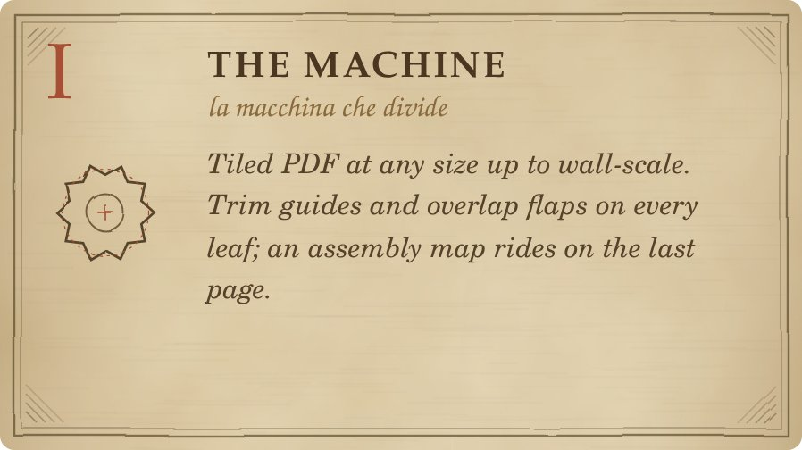
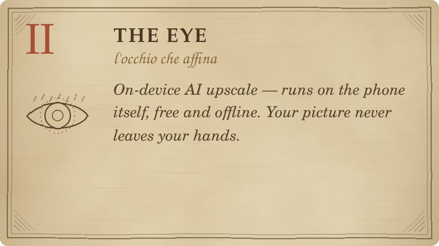
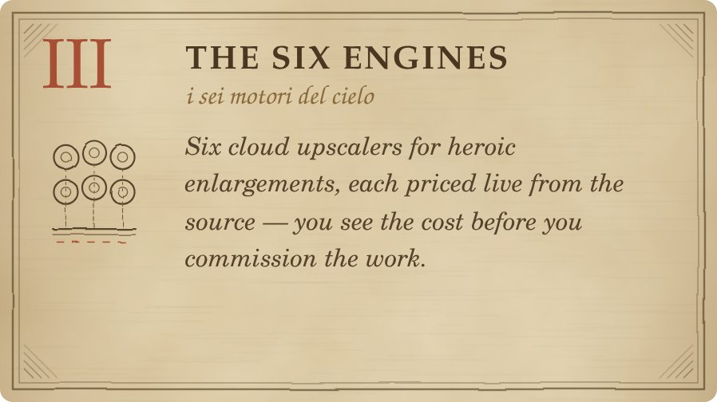
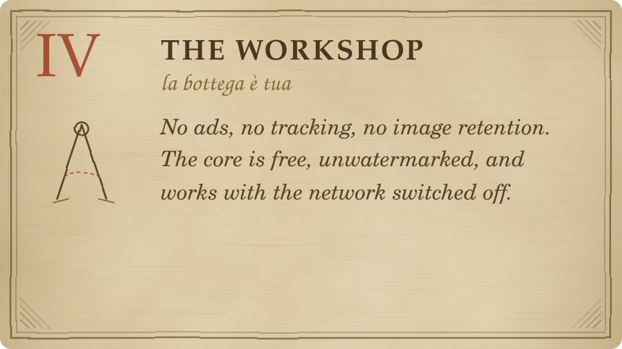
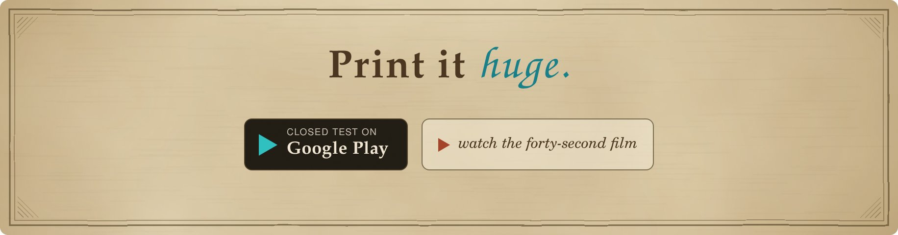

<picture>
  <source media="(prefers-color-scheme: dark)" srcset="docs/readme-assets/hero-dark.jpg">
  
</picture>

  
  
  
  
  

> **Poster PDF** turns any picture into a print-at-home poster: pick an image, choose a size,
> and the press hands you a tiled PDF — trim guides on every page, an assembly map at the end.

Five hundred years ago, making a picture monumental took a workshop, a wall, and an apprentice
with a grid. Poster PDF keeps the grid and retires the apprentice: the *machine* divides your
image into letter-size leaves, and any household printer becomes a poster press.

It is an Android app written in **Kotlin** with **Jetpack Compose** (Material 3), backed by
**Firebase** for the optional cloud features. The core — tiling, trim guides, the assembly
map, and on-device AI upscaling — is free, unwatermarked, and works with the network
switched off. Website: [posterpdf.web.app](https://posterpdf.web.app) · Film:
[the 40-second product video](https://www.youtube.com/watch?v=hQ0lYU83VVg).

## Study of proportion — how a picture becomes fifteen leaves

<picture>
  <source media="(prefers-color-scheme: dark)" srcset="docs/readme-assets/study-dark.jpg">
  
</picture>

What the plate records, in plain terms:

- A 24 × 36 in poster on letter paper comes out as **fifteen pages — 3 across, 5 down**.
- **Every page carries trim guides**, so you know exactly where to cut.
- **Edges overlap** by design, so scissors may err without ruining the poster.
- **The last page is the assembly map** — a little diagram of where every leaf goes.

Sizes are free-form — inches or centimetres, up to wall scale. The engine reckons the grain
of your picture (`original dpi → target dpi`) and warns you before a soft print, long before
ink touches paper.

| Poster | Leaves | Paper |
| --- | --- | --- |
| 18 × 24 in | 6 (3 × 2) | Letter, landscape |
| 24 × 36 in | 15 (3 × 5) | Letter, portrait |
| A0 (841 × 1189 mm) | 16 (4 × 4) | A4, portrait |

## The four folios

<table>
  <tr>
    <td width="50%">
      <picture>
        <source media="(prefers-color-scheme: dark)" srcset="docs/readme-assets/folio-i-dark.jpg">
        
      </picture>
    </td>
    <td width="50%">
      <picture>
        <source media="(prefers-color-scheme: dark)" srcset="docs/readme-assets/folio-ii-dark.jpg">
        
      </picture>
    </td>
  </tr>
  <tr>
    <td width="50%">
      <picture>
        <source media="(prefers-color-scheme: dark)" srcset="docs/readme-assets/folio-iii-dark.jpg">
        
      </picture>
    </td>
    <td width="50%">
      <picture>
        <source media="(prefers-color-scheme: dark)" srcset="docs/readme-assets/folio-iv-dark.jpg">
        
      </picture>
    </td>
  </tr>
</table>

- **Free core** — tiled PDF export, trim guides, assembly page. No watermark.
- **On-device AI upscale** — GPU-accelerated, streams big images without running out of memory.
- **Six cloud engines** — live per-model pricing; unavailable models hide themselves.
- **Ask Gemini** — an in-app advisor that reckons your pixels and suggests the right engine.
- **Private by construction** — no ads, no analytics, nothing stored after the job is done.

## The instrument itself

<picture>
  <source media="(prefers-color-scheme: dark)" srcset="docs/readme-assets/plate-studio-dark.jpg">
  
</picture>

*Plate III — the studio: pick a picture, set the finished size, and watch 10 dpi get reckoned into 150.*

<picture>
  <source media="(prefers-color-scheme: dark)" srcset="docs/readme-assets/plate-engines-dark.jpg">
  
</picture>

*Plate IV — the engines: the app warns before a soft print, on-device upscale is free, and Gemini advises which cloud engine fits.*

<picture>
  <source media="(prefers-color-scheme: dark)" srcset="docs/readme-assets/plate-proof-dark.jpg">
  
</picture>

*Plate V — the proof: compare every engine on the same picture, and read exactly what stays free.*

## Install

Poster PDF is in **closed test on Google Play** — the workshop opens to testers first.
The forty-second film below shows the press at work, from picture to pasted wall.

<a href="https://www.youtube.com/watch?v=hQ0lYU83VVg">
<picture>
  <source media="(prefers-color-scheme: dark)" srcset="docs/readme-assets/cta-dark.jpg">
  
</picture>
</a>

- **Website:** [posterpdf.web.app](https://posterpdf.web.app)
- **The 40-second film:** [youtube.com/watch?v=hQ0lYU83VVg](https://www.youtube.com/watch?v=hQ0lYU83VVg)
- **Privacy policy:** [posterpdf.web.app/privacy-policy](https://posterpdf.web.app/privacy-policy)
- **Delete your account:** [posterpdf.web.app/delete-account](https://posterpdf.web.app/delete-account)

---

**Kotlin · Jetpack Compose · Firebase** — built in a small workshop, like all good machines.
The Mona Lisa is public domain; Leonardo was not consulted, but we believe he would have shipped.

<picture>
  <source media="(prefers-color-scheme: dark)" srcset="docs/readme-assets/footer-dark.png">
  
</picture>

© 2026 Poster PDF — all rights reserved

